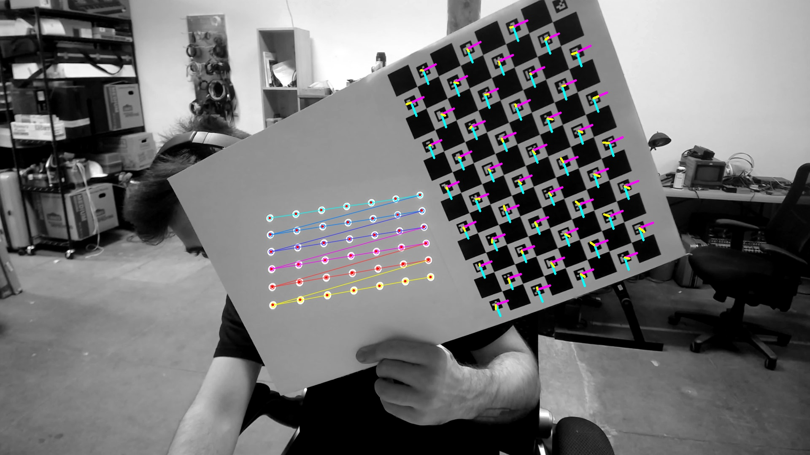

# TD_CameraProjectorCalibration
A TouchDesigner add-on that calibrates a camera + projector pair using OpenCV. Port of https://github.com/cyrildiagne/ofxCvCameraProjectorCalibration

The process requires 3 steps:

### 1. Camera Calibration. 

You will need to print out an ChAruco pattern and tape it to a white board, leaving half of the board empty for projection.

You will capture a number of different 'poses' with this grid in different positions around the camera's viewable region. For each image, the program will identify the ChAruco board pattern. Once you have collected enough points, you can calibrate the camera and move on to the projector.

### 2. Projector Calibration.

Now, you can enable the circle "dot" pattern and move the checkerboard so that the camera can see both the dot pattern and the ChAruco pattern. You'll collect a number of circle grid image sets before attempting to calibrate the stereo pair.

### 3. Stereo Calibration

This step runs right after projector calibration. It uses all of the collected point data and creates a stereo calibration between the camera and the projector.

# References

1. [Converting Between OpenCV and OpenGL Projection Matrices](https://strawlab.org/2011/11/05/augmented-reality-with-OpenGL/)
2. [Finding the Camera Pose Relative to the Chessboard](https://stackoverflow.com/questions/52833322/using-aruco-to-estimate-the-world-position-of-camera)
