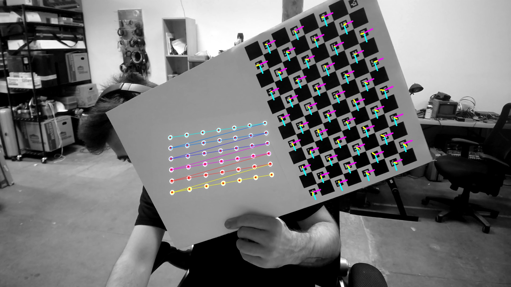

# TD_CameraProjectorCalibration
A TouchDesigner addon that helps calibrating a camera and a projector using OpenCV. Port of https://github.com/cyrildiagne/ofxCvCameraProjectorCalibration

The process takes three steps.

### 1. Camera Calibration. 

You will need to print out an aurco board and tape it to a white board, leaving half of the board empty for projection.

you will capture a number of different 'poses' with this grid in different positions around the cameras view window.

once you have collected enough points, you can calibrate the camera and move to the projector.

### 2. Projector Calibration.

Now you can enable the dot pattern and move the checkerboard so that the camera can see both the dot pattern and the checkers.

collect a number of circle grid sets before attempting to calibrate.

### 3. Stereo Calibration

This step runs right after projector calibration, it will use all of the collected point data and recalibrate the stereo connection between the camera and the projector.

# References

1. [Converting Between OpenCV and OpenGL Projection Matrices](https://strawlab.org/2011/11/05/augmented-reality-with-OpenGL/)
2. [Finding the Camera Pose Relative to the Chessboard](https://stackoverflow.com/questions/52833322/using-aruco-to-estimate-the-world-position-of-camera)

---